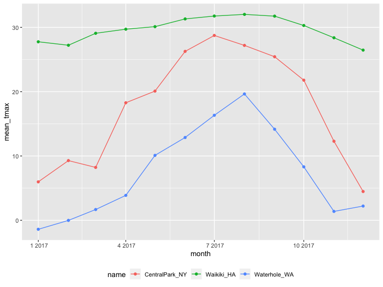
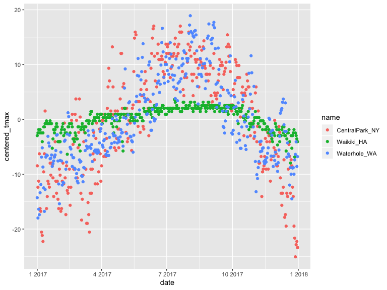

exploratory analysis using group\_by
================
Yuning Wang
10/3/2019

``` r
knitr::opts_chunk$set(
  echo = TRUE,
  warning = FALSE,
  fig.width = 8,
  fig.height = 6,
  out.width = "90%")

options(ggplot2.continuous.colour = "viridis")

library(viridis)
library(tidyverse)
library(ggridges)
library(patchwork)
```

``` r
weather_df = 
  rnoaa::meteo_pull_monitors(c("USW00094728", "USC00519397", "USS0023B17S"),
                      var = c("PRCP", "TMIN", "TMAX"), 
                      date_min = "2017-01-01",
                      date_max = "2017-12-31") %>%
  mutate(
    name = recode(id, USW00094728 = "CentralPark_NY", 
                      USC00519397 = "Waikiki_HA",
                      USS0023B17S = "Waterhole_WA"),
    tmin = tmin / 10,
    tmax = tmax / 10,
    month = lubridate::floor_date(date, unit = "month")) %>%
  select(name, id, date, month, everything())
```

## ‘group\_by’ function and counting

``` r
weather_df %>%
  group_by(name, month)
```

    ## # A tibble: 1,095 x 7
    ## # Groups:   name, month [36]
    ##    name           id          date       month       prcp  tmax  tmin
    ##    <chr>          <chr>       <date>     <date>     <dbl> <dbl> <dbl>
    ##  1 CentralPark_NY USW00094728 2017-01-01 2017-01-01     0   8.9   4.4
    ##  2 CentralPark_NY USW00094728 2017-01-02 2017-01-01    53   5     2.8
    ##  3 CentralPark_NY USW00094728 2017-01-03 2017-01-01   147   6.1   3.9
    ##  4 CentralPark_NY USW00094728 2017-01-04 2017-01-01     0  11.1   1.1
    ##  5 CentralPark_NY USW00094728 2017-01-05 2017-01-01     0   1.1  -2.7
    ##  6 CentralPark_NY USW00094728 2017-01-06 2017-01-01    13   0.6  -3.8
    ##  7 CentralPark_NY USW00094728 2017-01-07 2017-01-01    81  -3.2  -6.6
    ##  8 CentralPark_NY USW00094728 2017-01-08 2017-01-01     0  -3.8  -8.8
    ##  9 CentralPark_NY USW00094728 2017-01-09 2017-01-01     0  -4.9  -9.9
    ## 10 CentralPark_NY USW00094728 2017-01-10 2017-01-01     0   7.8  -6  
    ## # … with 1,085 more rows

``` r
weather_df %>%
  group_by(name) %>%
  summarize(n_obs = n())
```

    ## # A tibble: 3 x 2
    ##   name           n_obs
    ##   <chr>          <int>
    ## 1 CentralPark_NY   365
    ## 2 Waikiki_HA       365
    ## 3 Waterhole_WA     365

``` r
weather_df %>%
  group_by(month, name) %>%
  summarize(n_obs = n())
```

    ## # A tibble: 36 x 3
    ## # Groups:   month [12]
    ##    month      name           n_obs
    ##    <date>     <chr>          <int>
    ##  1 2017-01-01 CentralPark_NY    31
    ##  2 2017-01-01 Waikiki_HA        31
    ##  3 2017-01-01 Waterhole_WA      31
    ##  4 2017-02-01 CentralPark_NY    28
    ##  5 2017-02-01 Waikiki_HA        28
    ##  6 2017-02-01 Waterhole_WA      28
    ##  7 2017-03-01 CentralPark_NY    31
    ##  8 2017-03-01 Waikiki_HA        31
    ##  9 2017-03-01 Waterhole_WA      31
    ## 10 2017-04-01 CentralPark_NY    30
    ## # … with 26 more rows

``` r
weather_df %>%
  group_by(month) %>%
  summarize(
    n_obs = n(),
    n_unique = n_distinct(date))
```

    ## # A tibble: 12 x 3
    ##    month      n_obs n_unique
    ##    <date>     <int>    <int>
    ##  1 2017-01-01    93       31
    ##  2 2017-02-01    84       28
    ##  3 2017-03-01    93       31
    ##  4 2017-04-01    90       30
    ##  5 2017-05-01    93       31
    ##  6 2017-06-01    90       30
    ##  7 2017-07-01    93       31
    ##  8 2017-08-01    93       31
    ##  9 2017-09-01    90       30
    ## 10 2017-10-01    93       31
    ## 11 2017-11-01    90       30
    ## 12 2017-12-01    93       31

``` r
# can count things don't use group_by and summarize
weather_df %>% 
  count(name)
```

    ## # A tibble: 3 x 2
    ##   name               n
    ##   <chr>          <int>
    ## 1 CentralPark_NY   365
    ## 2 Waikiki_HA       365
    ## 3 Waterhole_WA     365

(make a nice table)

``` r
weather_df %>% 
  count(name) %>% 
  knitr::kable()
```

| name            |   n |
| :-------------- | --: |
| CentralPark\_NY | 365 |
| Waikiki\_HA     | 365 |
| Waterhole\_WA   | 365 |

## (2\*2) tables

a digression

``` r
weather_df %>% 
  filter(name != "Waikiki_HA") %>% 
  mutate(
    cold = case_when(
      tmax < 5  ~ "cold",
      tmax >= 5 ~ "not cold",
      TRUE      ~ ""
    )
  ) %>% 
  group_by(name, cold) %>% 
  count() %>% 
  pivot_wider(
    names_from = cold,
    values_from = n
  )
```

    ## # A tibble: 2 x 3
    ## # Groups:   name, cold [2]
    ##   name            cold `not cold`
    ##   <chr>          <int>      <int>
    ## 1 CentralPark_NY    44        321
    ## 2 Waterhole_WA     172        193

``` r
weather_df %>% 
  filter(name != "Waikiki_HA") %>% 
  mutate(
    cold = case_when(
      tmax < 5  ~ "cold",
      tmax >= 5 ~ "not cold",
      TRUE      ~ ""
    )
  ) %>% 
  janitor::tabyl(name, cold)
```

    ##            name cold not cold
    ##  CentralPark_NY   44      321
    ##    Waterhole_WA  172      193

## general summaries

``` r
weather_df %>% 
  group_by(name, month) %>% 
  summarize(
    n = n(),
    mean_tmax = mean(tmax, na.rm = TRUE),
    sd_tmax = sd(tmax, na.rm = TRUE),
    median_prcp = median(prcp, na.rm = TRUE)
  ) %>% 
  ggplot(aes(x = month, y = mean_tmax, color = name)) + 
  geom_point() + geom_line() + 
    theme(legend.position = "bottom")
```



``` r
# A check on missing values
weather_df %>% 
  filter(is.na(tmax))
```

    ## # A tibble: 3 x 7
    ##   name       id          date       month       prcp  tmax  tmin
    ##   <chr>      <chr>       <date>     <date>     <dbl> <dbl> <dbl>
    ## 1 Waikiki_HA USC00519397 2017-05-09 2017-05-01    NA    NA    NA
    ## 2 Waikiki_HA USC00519397 2017-05-26 2017-05-01    NA    NA    NA
    ## 3 Waikiki_HA USC00519397 2017-07-19 2017-07-01    NA    NA    NA

``` r
weather_df %>% 
  group_by(name) %>% 
  ungroup()
```

    ## # A tibble: 1,095 x 7
    ##    name           id          date       month       prcp  tmax  tmin
    ##    <chr>          <chr>       <date>     <date>     <dbl> <dbl> <dbl>
    ##  1 CentralPark_NY USW00094728 2017-01-01 2017-01-01     0   8.9   4.4
    ##  2 CentralPark_NY USW00094728 2017-01-02 2017-01-01    53   5     2.8
    ##  3 CentralPark_NY USW00094728 2017-01-03 2017-01-01   147   6.1   3.9
    ##  4 CentralPark_NY USW00094728 2017-01-04 2017-01-01     0  11.1   1.1
    ##  5 CentralPark_NY USW00094728 2017-01-05 2017-01-01     0   1.1  -2.7
    ##  6 CentralPark_NY USW00094728 2017-01-06 2017-01-01    13   0.6  -3.8
    ##  7 CentralPark_NY USW00094728 2017-01-07 2017-01-01    81  -3.2  -6.6
    ##  8 CentralPark_NY USW00094728 2017-01-08 2017-01-01     0  -3.8  -8.8
    ##  9 CentralPark_NY USW00094728 2017-01-09 2017-01-01     0  -4.9  -9.9
    ## 10 CentralPark_NY USW00094728 2017-01-10 2017-01-01     0   7.8  -6  
    ## # … with 1,085 more rows

``` r
weather_df %>%
  group_by(name) %>%
  mutate(
    mean_tmax = mean(tmax, na.rm = TRUE),
    centered_tmax = tmax - mean_tmax
  ) %>% 
  ggplot(aes(x = date, y = centered_tmax, color = name)) +
  geom_point()
```



window functions in grouped mutates ….

``` r
weather_df %>% 
  group_by(name, month) %>% 
  mutate(
    temp_ranking = min_rank(tmax)
  )
```

    ## # A tibble: 1,095 x 8
    ## # Groups:   name, month [36]
    ##    name       id       date       month       prcp  tmax  tmin temp_ranking
    ##    <chr>      <chr>    <date>     <date>     <dbl> <dbl> <dbl>        <int>
    ##  1 CentralPa… USW0009… 2017-01-01 2017-01-01     0   8.9   4.4           22
    ##  2 CentralPa… USW0009… 2017-01-02 2017-01-01    53   5     2.8           12
    ##  3 CentralPa… USW0009… 2017-01-03 2017-01-01   147   6.1   3.9           15
    ##  4 CentralPa… USW0009… 2017-01-04 2017-01-01     0  11.1   1.1           27
    ##  5 CentralPa… USW0009… 2017-01-05 2017-01-01     0   1.1  -2.7            5
    ##  6 CentralPa… USW0009… 2017-01-06 2017-01-01    13   0.6  -3.8            4
    ##  7 CentralPa… USW0009… 2017-01-07 2017-01-01    81  -3.2  -6.6            3
    ##  8 CentralPa… USW0009… 2017-01-08 2017-01-01     0  -3.8  -8.8            2
    ##  9 CentralPa… USW0009… 2017-01-09 2017-01-01     0  -4.9  -9.9            1
    ## 10 CentralPa… USW0009… 2017-01-10 2017-01-01     0   7.8  -6             21
    ## # … with 1,085 more rows

``` r
weather_df %>%
  group_by(name, month) %>%
  filter(min_rank(tmax) < 2)
```

    ## # A tibble: 42 x 7
    ## # Groups:   name, month [36]
    ##    name           id          date       month       prcp  tmax  tmin
    ##    <chr>          <chr>       <date>     <date>     <dbl> <dbl> <dbl>
    ##  1 CentralPark_NY USW00094728 2017-01-09 2017-01-01     0  -4.9  -9.9
    ##  2 CentralPark_NY USW00094728 2017-02-10 2017-02-01     0   0    -7.1
    ##  3 CentralPark_NY USW00094728 2017-03-15 2017-03-01     0  -3.2  -6.6
    ##  4 CentralPark_NY USW00094728 2017-04-01 2017-04-01     0   8.9   2.8
    ##  5 CentralPark_NY USW00094728 2017-05-13 2017-05-01   409  11.7   7.2
    ##  6 CentralPark_NY USW00094728 2017-06-06 2017-06-01    15  14.4  11.1
    ##  7 CentralPark_NY USW00094728 2017-07-25 2017-07-01     0  21.7  16.7
    ##  8 CentralPark_NY USW00094728 2017-08-29 2017-08-01    74  20    16.1
    ##  9 CentralPark_NY USW00094728 2017-09-30 2017-09-01     0  18.9  12.2
    ## 10 CentralPark_NY USW00094728 2017-10-31 2017-10-01     0  13.9   7.2
    ## # … with 32 more rows

leg and leading

``` r
weather_df %>%
  group_by(name) %>%
  mutate(
    lagged_tmax = lag(tmax),
    one_day_tmax_change = tmax - lagged_tmax) %>% 
  summarize(sd_daily_change = sd(one_day_tmax_change, na.rm = T))
```

    ## # A tibble: 3 x 2
    ##   name           sd_daily_change
    ##   <chr>                    <dbl>
    ## 1 CentralPark_NY            4.45
    ## 2 Waikiki_HA                1.23
    ## 3 Waterhole_WA              3.13
